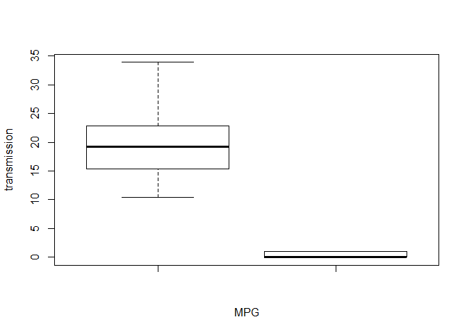
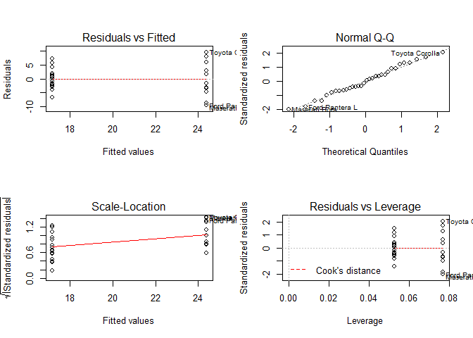
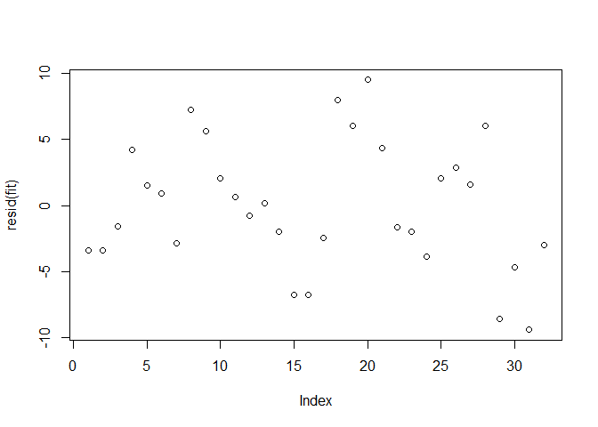

# Linear Regression Assignment: Effect of variables on MPG
Yasneen Ashroff  
September 1, 2016  
# Instructions
Looking at a data set of a collection of cars, explore the relationship between a set of variables and miles per gallon (MPG) (outcome). Focus on the following two questions:

- Is an automatic or manual transmission better for MPG
- Quantify the MPG difference between automatic and manual transmissions

# Summary of findings
It appears that MPG is affected more by manual transmission than automatic. However, a correct model of the data would also need to include weight, drat and qsec.

# Analysis
Beginning with a simple boxplot, it seems like mpg is higher with automatic transmission than with manual. 

```r
data(mtcars)
boxplot(mtcars$mpg,mtcars$am,ylab="transmission",xlab="MPG")
```

<!-- -->

Fit a model considering am as a factor variable:

```r
fit<-lm(mpg ~  factor(am) -1, data=mtcars )
summary(fit)$coef
```

```
##             Estimate Std. Error  t value     Pr(>|t|)
## factor(am)0 17.14737   1.124603 15.24749 1.133983e-15
## factor(am)1 24.39231   1.359578 17.94109 1.376283e-17
```

We can see that value 1 (manual) has a higher coefficent and therefore has a higher impact on MPG. Plotting residuals vs Fitted values and Residuals vs Leverage, and the residuals are equally distributed around the fitted values. It does not appear that one value is skewing the results and the Q-Q plot indicates the population is approximately normal, so a poisson model is not required.

```r
par(mfrow=c(2,2))
plot(fit)
```

<!-- -->
looking at the residuals in more detail, they appear to be randomly distributed, indicating that the model is a good fit of the data.

```r
plot(resid(fit))
```

<!-- -->
Based on the results above, it appears that manual transmission has a larger impact on MPG. 

However, it's important to consider the impacts of other variables.

Fit a model considering all variables and look at the weights of the coefficients of each variable.

```r
fit<-lm(mpg ~ .-1, data=mtcars)
summary(fit)$coef
```

```
##         Estimate Std. Error     t value   Pr(>|t|)
## cyl   0.35082641 0.76292423  0.45984438 0.65014009
## disp  0.01354278 0.01762273  0.76848373 0.45037109
## hp   -0.02054767 0.02143989 -0.95838513 0.34828334
## drat  1.24158213 1.46276742  0.84878985 0.40513967
## wt   -3.82613150 1.86238084 -2.05443023 0.05200271
## qsec  1.19139689 0.45942323  2.59324480 0.01659185
## vs    0.18972068 2.06824861  0.09173011 0.92774262
## am    2.83222230 1.97512820  1.43394353 0.16564985
## gear  1.05426253 1.34668717  0.78285629 0.44205756
## carb -0.26321386 0.81235653 -0.32401273 0.74898869
```
loking at the coefficients, it seems that while transmission (variable name am) has a largest impact on MPG, weight (variable name wt) has a larger impact on MPG. Third impactful is drat (rear axle ratio) followed by qsec (1/4 mile time).

It appears the correct model would include not just transmission, but also weight, rear-axle ratio and 1/4 mile time. Fit a model with these 4 variables.

```r
fit1<- lm(mpg~wt+am+drat+qsec-1,data=mtcars)
summary(fit)
```

```
## 
## Call:
## lm(formula = mpg ~ . - 1, data = mtcars)
## 
## Residuals:
##     Min      1Q  Median      3Q     Max 
## -3.7721 -1.6249  0.1699  1.1068  4.4666 
## 
## Coefficients:
##      Estimate Std. Error t value Pr(>|t|)  
## cyl   0.35083    0.76292   0.460   0.6501  
## disp  0.01354    0.01762   0.768   0.4504  
## hp   -0.02055    0.02144  -0.958   0.3483  
## drat  1.24158    1.46277   0.849   0.4051  
## wt   -3.82613    1.86238  -2.054   0.0520 .
## qsec  1.19140    0.45942   2.593   0.0166 *
## vs    0.18972    2.06825   0.092   0.9277  
## am    2.83222    1.97513   1.434   0.1656  
## gear  1.05426    1.34669   0.783   0.4421  
## carb -0.26321    0.81236  -0.324   0.7490  
## ---
## Signif. codes:  0 '***' 0.001 '**' 0.01 '*' 0.05 '.' 0.1 ' ' 1
## 
## Residual standard error: 2.616 on 22 degrees of freedom
## Multiple R-squared:  0.9893,	Adjusted R-squared:  0.9844 
## F-statistic:   203 on 10 and 22 DF,  p-value: < 2.2e-16
```
Given this, it appears that while automatic and manual transmission have a large impact on MPG, we cannot conclude they are the only important factors as weight has a larger impact (-3.8 versus approximately 3). However, manual transmission does have a larger impact than automatic (24 vs 17, holding all other variables constant). 
